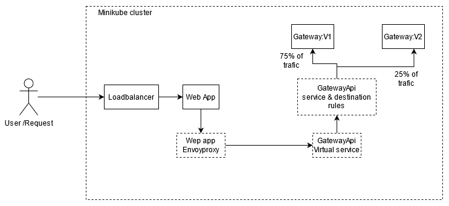

# Introduction

Simple project to explorer contenarize application development concepts.

# Project structure

WebApp - Asp.net core web application
GatewayApi - Asp,net core WebApi

WebApp call Api methods implemented in GatewayApi

# Deployment/ Dev enviornment

Web app and Gateway Api is deployed as docker images in minikube cluster in windows enviornment. But images are based on linux containers.

# Docker commmands for WebApp
docker build -t mywebapp -f ../DockerFiles/WebApp/Dockerfile .
docker run -it --rm -p 50080:80 -p 50443:443 --env-file D:\WebApp.env --name my_webapp mywebapp

# Docker command for GatewayApi
docker build -t mygateway:v1 -f ../DockerFiles/GatewayApi/Dockerfile .
docker run -it --rm -p 51080:80 -p 51443:443 -v -v D:\file_share:/app/file_share --name api_gateway mygateway

# Kubernetes commmands for WebApp
Refer kubernetes files for details

# Kubernetes command for GatewayApi
Refer kubernetes files for details